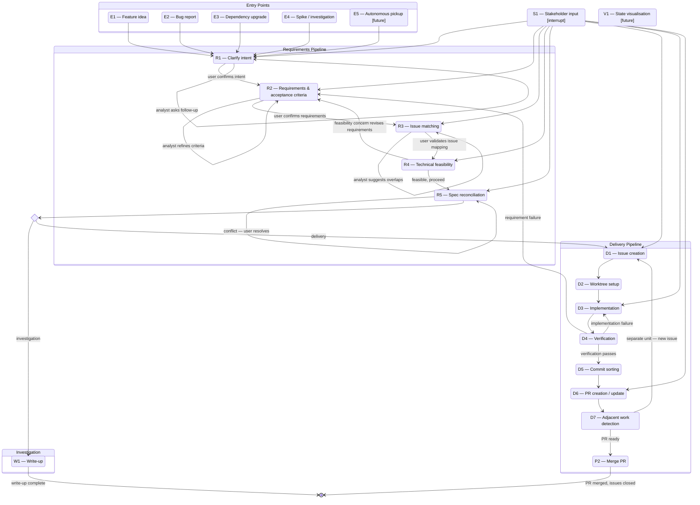

# topgun

Installs and manages Claude Code configuration.

## Prerequisites

**GitHub CLI** authenticated: `gh auth login` — topgun uses `gh` for all GitHub operations. Run this once per host.

**Obsidian** — used as a local task store for `topgun backlog`. Install via `brew install --cask obsidian` or from [obsidian.md](https://obsidian.md). Create a vault and enable the **Tasks** community plugin for due dates and priorities.

## Setup

### Users

Add an alias to your shell config (`~/.zshrc` or `~/.bashrc`):

```bash
alias topgun='docker run --rm -it \
  -v "$(pwd):/project" \
  -v "$HOME/.claude:/claude" \
  -v "$HOME/.ssh:/root/.ssh:ro" \
  -v "$HOME/.config/topgun:/topgun-config" \
  -v "$HOME/.topgun:/topgun-data" \
  -e GITHUB_TOKEN="$(gh auth token 2>/dev/null)" \
  -e TOPGUN_CONFIG=/topgun-config/config.json \
  -e TOPGUN_VAULT=/topgun-data/archive \
  -e OBSIDIAN_DIR=/topgun-data \
  ghcr.io/diogobaltazar/topgun:latest'
```

### Developers

Clone the repo and build from source:

```bash
git clone https://github.com/diogobaltazar/topgun ~/topgun
cd ~/topgun
docker compose build topgun
```

Add an alias:

```bash
alias topgun='GITHUB_TOKEN=$(gh auth token) docker compose --progress quiet -f $HOME/topgun/compose.yml run --rm topgun'
```

---

Reload your shell after adding the alias:

```bash
source ~/.zshrc
```

### GitHub tokens

Each GitHub source uses a named environment variable for its token. When you run `topgun backlog track`, you choose the variable name (default: `GITHUB_TOKEN`). Different repos — different orgs, different accounts — can use different variables.

Export each token in `~/.zshrc`:

```bash
export GITHUB_TOKEN=$(gh auth token)
export GITHUB_TOKEN_ROCHE=$(gh auth token --hostname github.roche.com)
```

topgun never stores tokens. It stores only the variable name and reads the value at runtime. If a token is missing or invalid, `topgun backlog watch` shows a warning for that source and continues fetching the rest.

## Commands

| Command | Does |
|---|---|
| `topgun install` | Install global Claude config onto host (`~/.claude`) |
| `topgun reinstall` | Wipe `~/.claude` and reinstall from scratch |
| `topgun uninstall` | Remove topgun config from `~/.claude` |
| `topgun observe start` | Start the live session dashboard at `http://localhost:5100` (detached) |
| `topgun observe stop` | Stop the dashboard containers |
| `topgun observe restart` | Restart the dashboard containers |
| `topgun observe status` | Show running (green) / down (red) status for each container |
| `topgun config observe add <path>` | Register a project for the dashboard to monitor |
| `topgun config observe remove <path>` | Deregister a project |
| `topgun config observe list` | List registered projects |

### topgun install

Run once per host. Installs to `~/.claude`:

```
~/.claude/
├── CLAUDE.md        # global persona and tone
├── settings.json    # env vars + lifecycle hooks
├── hooks/
│   ├── log-session-start.sh   # writes meta.json + session.start event
│   ├── log-tool-event.sh      # appends tool.call events (PostToolUse)
│   └── log-session-end.sh     # derives outcome + session.end (Stop)
├── agents/
│   ├── analyst.md   # R1–R5, W1, decision gate
│   ├── engineer.md  # D3–D4
│   ├── github.md    # D1, D6, D7, P2
│   └── git.md       # D5
└── commands/
    ├── feature.md   # /feature — full lifecycle orchestrator
    ├── github.md    # /github
    ├── git.md       # /git
    └── project.md   # /project
```

```bash
topgun install          # install into ~/.claude
topgun install --force  # overwrite existing files
topgun reinstall        # wipe ~/.claude and reinstall from scratch
```

### topgun observe

```bash
topgun observe start    # build and start topgun-api + topgun-web, detached
topgun observe stop     # stop containers
topgun observe restart  # restart containers
topgun observe status   # green ● running / red ● down per container
```

The dashboard runs at **http://localhost:5100**. It watches `~/.claude/logs/` for active Claude sessions and renders the lifecycle state machine with the current step highlighted.

Register projects to observe (see [topgun config](#topgun-config)):

```bash
topgun config observe add ~/source/my-project
```

### topgun config

A CLI command that runs inside the topgun container. Config is stored at `~/.config/topgun/config.json` (mounted read-write into the container).

```bash
topgun config observe add ~/source/my-project     # register a project
topgun config observe remove ~/source/my-project  # deregister
topgun config observe list                        # print registered projects
```

Paths are resolved to absolute form. `topgun observe` will filter sessions to registered projects only; if no projects are registered it shows all active sessions.

### topgun uninstall

Removes topgun's global config from `~/.claude`.

```bash
topgun uninstall      # prompts for confirmation
topgun uninstall -y   # skip confirmation
```

## Feature Lifecycle

Topgun implements a structured engineering workflow as a state machine. Every unit of work — feature, bug fix, dependency upgrade, or investigation — passes through the same pipeline.



See [CLAUDE.md](CLAUDE.md) for the full process specification with actors, triggers, inputs, outputs, and exit conditions for each step.

## This repo IS the config

The `global/` directory is the source of truth. All definitions flow via `topgun install`:

```
global/  →  topgun install  →  ~/.claude/
```

Never edit `~/.claude` directly — changes are overwritten on the next `topgun reinstall`.

## Contributing

### Commit signing

All commits must be signed. This repo uses SSH signing — no GPG required.

Add to your `~/.gitconfig` (or the repo-local `.git/config`):

```ini
[user]
    signingkey = ~/.ssh/<your-signing-key>.pub

[gpg]
    format = ssh

[commit]
    gpgsign = true
```

The signing key should be an SSH key whose **public** half is registered as a *signing key* on your GitHub account (Settings → SSH and GPG keys → New signing key). It does not need to be the same key you use for authentication.

With that in place, `git commit` signs automatically — no extra flags needed. GitHub will show a "Verified" badge on each commit.

## Build

```bash
docker build -t topgun .
```

---

For a full explanation of Claude Code's configuration primitives — settings.json, hooks, agents, slash commands, CLAUDE.md — see [docs/reference.md](docs/reference.md).

---

## Claude Setup

Design decisions made to the Claude Code configuration that lives in `global/` and is installed to `~/.claude/`.

### Architecture overview

The setup is built around three Claude Code primitives:

| Primitive | What it is | Where |
|-----------|-----------|-------|
| **Command** | A slash command (`/feature`) that runs in the main session as Topgun | `global/commands/feature.md` |
| **Agent** | A specialist subagent spawned by the command | `global/agents/` |
| **Hook** | A shell script fired at lifecycle events | `global/hooks/` |

### Agent teams — parallel research phase

The `/feature` command orchestrates a parallel research phase before any implementation work begins. Three specialist agents run simultaneously:

| Agent | Model | Purpose |
|-------|-------|---------|
| `deep-research` | claude-sonnet-4-6 | External knowledge — technology patterns, prior art, business context |
| `code-inspect` | claude-sonnet-4-6 | Codebase knowledge — architecture, conventions, entry points, constraints |
| `backlog-inspect` | claude-haiku-4-5-20251001 | GitHub backlog — duplicates, related issues, blockers |

**Why teammate mode, not subagents**

The original design used `Agent` tool calls with `run_in_background: true`. This launches agents asynchronously but the orchestrator still blocks — it cannot return to the user until all three resolve. Teammate mode (enabled via `CLAUDE_CODE_EXPERIMENTAL_AGENT_TEAMS=1`) uses `TeamCreate` + named teammates, which allows the lead to return to the user immediately and collect results across turns via `SendMessage`.

**Why these three agents**

- `deep-research` and `backlog-inspect` access external systems (Gemini/web, GitHub) — genuine I/O parallelism worth the overhead.
- `code-inspect` reads the local codebase. It was kept as a teammate because in the fire-and-return model the lead cannot do the reading itself before returning to the user. If the design reverts to blocking, `code-inspect` is the first candidate to fold back into the main session.

**Model selection rationale**

- `claude-opus-4-6` for the orchestrator (Topgun): synthesis across multiple research streams requires the strongest reasoning.
- `claude-sonnet-4-6` for research agents: capable web search and code reading, faster and cheaper than Opus.
- `claude-haiku-4-5-20251001` for backlog-inspect: purely JSON parsing and pattern matching against GitHub issue data — no reasoning depth needed.

### Deep research — Gemini relay pattern

`deep-research` does not call `WebSearch` directly. Instead:

1. It analyses what external knowledge the feature actually requires.
2. It formulates 1–3 targeted prompts and asks the user to run them in **Gemini Deep Research**.
3. The lead relays the queries to the user; the user pastes results back; the lead relays results to the agent.
4. The agent synthesises Gemini output with codebase context and reports to the lead.

**Why**: Gemini Deep Research uses Google's own search index and runs a genuine multi-step iterative research loop. `WebSearch` via Brave cannot match it for breadth or depth. The man-in-the-middle relay keeps the agent in the loop without requiring API access to Gemini Deep Research (which is a product feature, not an exposed endpoint).

If no external knowledge is genuinely needed, the agent skips to synthesis immediately.

### Hook design

Hooks capture lifecycle events without requiring agents to emit logging themselves.

| Hook | Event | Does |
|------|-------|------|
| `log-session-start.sh` | `PreToolUse` (fires once via sentinel) | Creates log dir, writes `meta.json`, emits `session.start` |
| `log-session-end.sh` | `Stop` | Derives outcome from last `step.exit`, emits `session.end`, updates `meta.json` |
| `log-subagent-start.sh` | `SubagentStart` | Maps agent type → step code, emits `step.enter` |
| `log-subagent-stop.sh` | `SubagentStop` | Maps agent type → step code, emits `step.exit` |

**Why hooks for step logging, not agent-side bash**: hooks fire reliably regardless of what the agent does. If step logging were written into each agent's prompt, an agent that crashes or returns early would miss the exit event. The hook fires at the OS process boundary.

`PostToolUse` / `log-tool-event.sh` was removed — it generated tool-call events that no downstream consumer used, adding noise with no benefit.

### Status line

A `statusline.sh` script provides a live progress bar at the bottom of every Claude Code session:

```
█████████░░░░░░░░░░░  45%   Claude Sonnet 4.6   12.4k / 200k tokens
```

Colour transitions: green → yellow (60%) → red (85%).

The script lives at `~/.claude/statusline.sh` directly (not inside `global/`) and is wired into `settings.json`. If you run `topgun reinstall`, the settings entry is preserved but the script must be recreated manually — or moved into `global/` to be managed by topgun.

### Teammate mode display

`"teammateMode": "in-process"` is set in `~/.claude.json`. This renders all teammates in the main terminal rather than spawning tmux panes. Use `Shift+Up/Down` to switch between agents, `Enter` to view.

Tmux mode was not chosen because the setup runs over an SSH/ONA connection where tmux pane lifecycle is less reliable.
